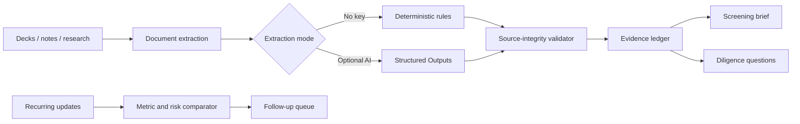

<div align="center">

# Fund Workbench

**Open-source, evidence-first workflow tools for investors, accelerators, corp-dev teams, and operators.**

[](https://github.com/Hritikd/fund-workbench/actions/workflows/ci.yml)
[](LICENSE)
[](pyproject.toml)

</div>

Fund Workbench turns pitch decks, call notes, research, and recurring updates into traceable artifacts. It is designed around a simple rule: **a model may propose structure, but it may not silently turn a claim into a fact.**

The repository contains four connected tools:

| Tool | Input | Output |
|---|---|---|
| Evidence Ledger | PDF, DOCX, Markdown, text, or pasted notes | Claims with source, status, quote, and confidence |
| Screening Brief | Evidence ledger + explicit thesis | Reviewable memo with transparent thesis routing |
| Diligence Planner | Evidence ledger | Prioritized questions tied to missing or conflicting evidence |
| Portfolio Update Comparator | Two lightweight company updates | Metric deltas, changed risks, asks, and follow-up queue |

The web interface works immediately with a synthetic company and no API key. An optional OpenAI integration uses Structured Outputs to improve semantic extraction; deterministic code still validates source IDs, quotes, and evidence status after the model responds.

> [!IMPORTANT]
> Fund Workbench supports human review. It does not make investment decisions or replace legal, financial, security, commercial, or technical diligence.

## Try it in two minutes

You need Python 3.10+ and [uv](https://docs.astral.sh/uv/).

```bash
git clone https://github.com/Hritikd/fund-workbench.git
cd fund-workbench
uv sync --extra dev
uv run streamlit run app.py
```

Open the local URL, click **Load synthetic demo**, then **Build evidence ledger**. The demo uses a fictional industrial-software company.

Generate all three portable demo artifacts from the command line:

```bash
uv run fund-workbench demo --output demo-output
```

No API key is required for either path.

## Use AI-assisted extraction

Copy `.env.example` to `.env`, set `OPENAI_API_KEY`, then export it in your shell or load it with your preferred secret manager.

```bash
export OPENAI_API_KEY="your-key"
export OPENAI_MODEL="gpt-6-astra"
uv run streamlit run app.py
```

The optional integration uses the OpenAI Responses API with a Pydantic schema, following the official [Structured Outputs guide](https://developers.openai.com/api/docs/guides/structured-outputs). The request sets `store=False`. Your organization’s API configuration and data policies still apply; do not send confidential material without authorization.

## Command-line workflows

Build a ledger from local documents:

```bash
uv run fund-workbench evidence \
  --company "Example Co" \
  --source-type company \
  notes/example-company.md notes/reference-call.md
```

Add `--ai` when a valid API key is present. Supported files are `.txt`, `.md`, `.pdf`, and `.docx`.

Create a memo from a ledger and thesis:

```bash
uv run fund-workbench memo evidence-ledger.json examples/thesis.json
```

Compare normalized portfolio updates:

```bash
uv run fund-workbench compare-updates previous.json current.json
```

## Evidence statuses

| Status | Meaning |
|---|---|
| `verified` | Supported by the supplied independent source; still subject to source quality |
| `company_reported` | Stated by company-controlled material |
| `reported` | Recorded in notes or an internal source |
| `inferred` | An explicit interpretation rather than a quoted fact |
| `unknown` | Required information is absent or explicitly unknown |
| `contradicted` | Sources disagree and require human resolution |

Company material cannot mark its own claims `verified`. If an AI-generated quote is not found verbatim in the referenced source, Fund Workbench removes the quote and downgrades the claim to `inferred`.

## Architecture



The application does not include a database or telemetry. Uploaded files are processed in memory by the running process. See [architecture](docs/architecture.md), [security and privacy](SECURITY.md), and [design decisions](docs/design-decisions.md).

## Why this is not another deck summarizer

Summaries compress information but often erase provenance. Fund Workbench treats provenance as part of the output:

- Every material claim retains a source ID.
- Quotes must exist verbatim in that source.
- Company claims remain company-reported.
- Unknowns generate questions instead of synthetic answers.
- Thesis routing exposes matched terms and penalties.
- Update comparison converts changes into an operational follow-up queue.
- All artifacts export as JSON or Markdown and can enter another workflow.

## Measure efficiency honestly

The project does not claim “10× faster.” Use the [evaluation protocol](docs/evaluation.md) to measure:

- time from source receipt to a reviewable brief;
- material claims captured;
- unsupported claims incorrectly promoted;
- contradictions surfaced;
- human editing time;
- questions accepted by the reviewer.

The sample regression tests check source integrity and key workflow behavior. They do not establish investment quality.

## Develop

```bash
uv sync --extra dev
uv run pytest
uv run ruff check .
```

Or use Docker:

```bash
docker build -t fund-workbench .
docker run --rm -p 8501:8501 fund-workbench
```

## Roadmap

- [ ] Editable claim review before export
- [ ] Configurable thesis templates
- [ ] Redaction helpers for sensitive documents
- [ ] CRM-neutral webhook output
- [ ] Reviewer calibration sets
- [ ] Additional model providers behind the same validated schema

Issues and pull requests are welcome. Please read [CONTRIBUTING.md](CONTRIBUTING.md) before contributing.

## License

MIT © [Hritik Datta](https://github.com/Hritikd)
